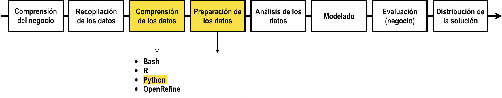

# Programación en IPython para Analítica Descriptiva

**Juan David Velásquez Henao**    
Universidad Nacional de Colombia, Sede Medellín  
Facultad de Minas  
Medellín, Colombia  

[Licencia](https://github.com/jdvelasq/IPython-for-descriptive-analytics/blob/master/LICENSE)
